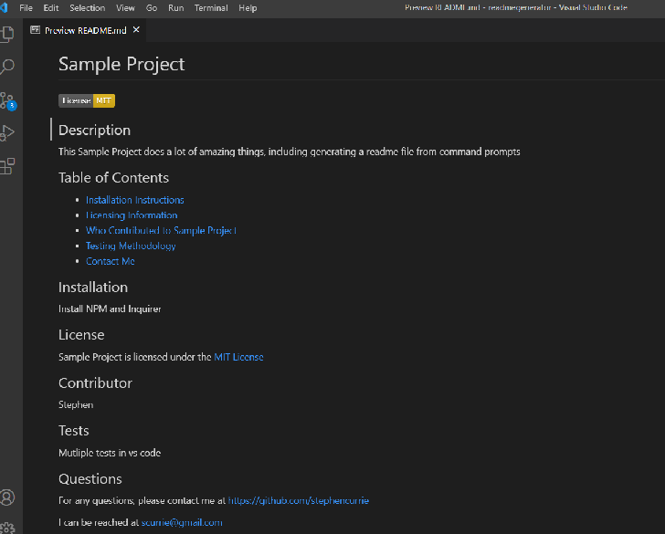

# Readme File Generator

## Description

This code generates an automatic Readme file by asking questions via the command prompt.  The code uses NPM as the package manager for Node Javascript platform. Within NPM, the code uses Inquirer to prompt the user via the command line.

To run the code, run "node index.js"  The readme that is generated is called, READMESAMPLE.md

## Table of Contents

- [Screenshots and Links](#screenshots)
- [Acceptance Criteria](#acceptance)
- [What I Learned](#learned)

## ScreenShots

Below is a screenshot of a sample output of the readme file based on answering questions in the command prompt.

Here is a video of what the command prompts look like and the sample it creates. [Video](https://drive.google.com/file/d/1dmeGtRbtIu1nEu67wo9YuM6xp2iN4Wm8/view)

The code is in the [GitHub Repository](https://github.com/stephencurrie/readmegenerator)

## Acceptance

The following were the acceptance criteria for the project:

- [x] When I am prompted for information about my application repository, a high-quality READMESAMPLE.md file is generated
- [x] This file has sections entitled: Description, Table of Contents, Installation, Usage, License, Contributing, Tests, and Questions
- [x] When a project title is entered, it is displayed as the title of the READMESAMPLE
- [x] When information about the remaining sections are entered, that information is displayed under the corresponding section
- [x] When a user chooses a license from a list of options, then a badge for that license is displayed at the top of the READMESAMPLE and a notice is added to the section of the README entitled License that explains which license the application is covered under
- [x] When the user enters their Github username, a link is displayed to their GitHub profile
- [x] When the user enters their email address, it is added to the Questions section, with instructions on how to contact the person
- [x] When a user clicks on links in the Table of Contents, they are taken to the corresponding section

## Learned

The following is a list of things I learned:

- How to install NPM
- How to install and use Inquirer
- How to use Node
- How to require packages
- How to use template literals
- How to generate a file from command prompts
- How to use .gitignore
- How to Screencastify to create a video of the command prompt